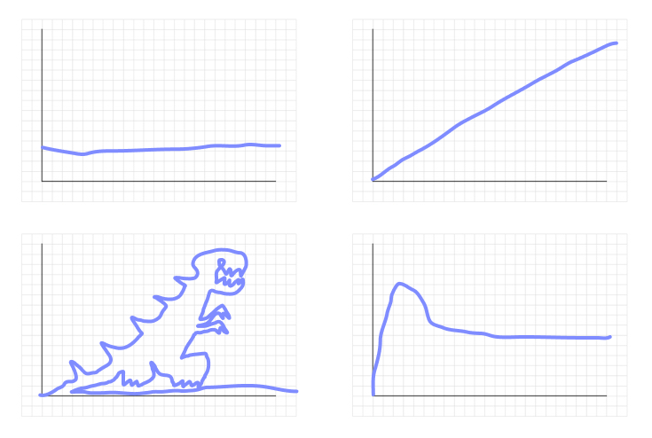

# Game Design

> [\#game design](https://memex.changbai.li/#tag-game%20design)

## Choices maketh game

Games are about choices - giving the player options that are meaningful for them. By making these choices and overcoming challenges, players gain a feeling of agency. These choices are called **game mechanics**.

So for a first step, your game can't be a rollercoaster ride. The player needs to be able to fall off the rollercoaster, or win a bonus giftbag if they ride it very well.

Often new game designers would make game mechanics that feel boring or pointless. This is because the choice isn't impactful or meaningful. Picking the color of your shield is a choice, but if that doesn't impact the gameplay, then it doesn't make much difference to the player. You can spot these kind of mistakes in many commercial games - such as the ending to Mass Effect 3, where (without spoiling anything) the only substantial difference your choice makes is the color of the lazer.

There are many ways to make choices meaningful. One method is to make sure there isn't a universally right choice: make the player pick between a shield that provides more defense but makes you move slower, or a shield that doesn't impede your movement, but will fail to block strong attacks. Which one is better? That depends on the player's playstyle, and by choosing one according to their style, this choice gives the player a sense of agency. Another important technique is to present enough information to the player to make the choice. Continuing with the shield example, if the player hasn't battled with any monsters, then they wouldn't know which playstyle fits them better, thus rendering the choice of the shield meaningless - not because they won't affect the gameplay differently later, but because it doesn't make a difference to the player at the time of choosing.

> Items and upgrades are common, very intuitive examples of choice as game mechanics. There are more subtle ones, such as shortcuts in a map, light attack v.s. heavy attack, or which direction to move, jump, or attack in a platformer. Analyse the moment-to-moment gameplay of a game, and see where the player is made to evaluate the situation and make a choice.

## How to choose your game mechanics?

There are many angles to consider when choosing game mechanics. 

Ultimately, it's about what the player perceives when playing your game: What kind of emotions will they be going through? What kind of fun are they having? What _reason_ do they have for playing your game?

From there, we can think about what type of actions would lead to these sensations, these emotions. From there, we can think about what game mechanics - what rules the game should have, in order for the player to naturally take these actions.

This is called the MDA framework.

### MDA Framework

- __Mechanics__ - The rule of a game, and the players' direct actions as a consequence of these rules. E.g. Only being able to revive at your corpse in World of Warcraft; The way each chess pieces move; the balance between rock, paper, and scissors.
- __Dynamics__ - The emerging behaviors of players. E.g. corpse camping, complex strategies in chess, using rock-paper-scissors to decide who the last piece of chocolate belongs to.
- __Aesthetics__ - The mindset and emotions that players fall into during the game.

### Aesthetics - 8 Kinds of Fun

#### Sensation
Game as sense-pleasure.
#### Fantasy
Game as make-believe.
#### Narrative
Game as unfolding story.
#### Challenge
Game as obstacle course. Satisfy player's power fantasy.
#### Fellowship
Game as social framework. Satisfy player's need for social interaction and bonding.
#### Discovery
Game as uncharted territory. Satisfy player's desire to explore.
#### Expression
Game as soap box, a place where players can express their creativity.
#### Submission
Game as mindless pastime.

These are just examples of what kind of fun gaming can provide us. It's not limited to these. If you find a new one, mark it down!

[Extra Credits - Aesthetics of Play](https://www.youtube.com/watch?v=uepAJ-rqJKA)

### Other angles to consider from

Audience: What kind of players will be playing the game, and for what goal? Are they parents looking for quality family time? Or tired workers trying to turn off their brain while riding the subway?

Platform: What devices will the players be playing this game on? What does that mean for the control scheme? What about the environment they could be playing in? On a comfy couch, or a bumpy bus?

Skill set: What do you, or your team, excel at? What kind of mechanics or games does that allow you to make quickly?

Overall, just keep in mind that there are always limitations to your project. A completely free space for expression is extremely rare. But if you can decide which angles to approach from by taking inspiration from these limitations, then they are no longer a prison.

### Game Design Grammar

Another interesting approach to try.

[A Game Design Grammar](https://onlyagame.typepad.com/only_a_game/2005/11/a_game_design_g.html)

Simply put, you can design a form of play by looking at the __nouns__: entities in the game, __verbs__: what the entities do, and __adjective/adverb__: additional attributes to the entities and verbs. From then on you can form sentences that describe the gameplay.

## From Mechanics to Levels

Levels are the stages where your player can explore the mechanics. They also help padding out the game, keeping it interesting and letting players enjoy it for a long time.

Levels come in many forms, sometimes discrete environments, stages; other times a smooth increase in difficulty. Whatever the form, a good progression of levels would have its difficulty looking something like this:

This image is from _Star Wars: A New Hope_, mapping out the tension in its story over time. Most media that has a time element would follow a curve like this.

Notice that the graph is not a constantly upward slope; it has rises and falls. This is important: the moments of calm gives the watcher, and in our case, the players, a chance to relax, rest their fingers, and brace for a new wave of impact.

*(What are the issues with these curves? Can you think of an example game or movie that matches these?)*

One approach is to think of each level as a story. This ensures the journey that player takes match the narrative of the game. Example: [Celeste](https://www.youtube.com/watch?v=4RlpMhBKNr0&feature=youtu.be&t=351)

Another approach, which focuses on developing the level around mechanic(s), is [~~Nintendo~~ Koichi Hayashida's 4 step approach](https://www.youtube.com/watch?v=dBmIkEvEBtA): Introduce the mechanic in a safe environment, Further develop the mechanic, Add a twist to it, and finally give the player a chance to show off their mastery. This approach gives player satisfaction in learning and mastering the mechanics, and is a generally good starting point for coming up with your levels.

## Paper Prototyping

A quick way to better visualize the game design is by drawing it on paper. You can do it storyboard style, or use small pieces of paper for the moving elements, and move them around the level to visualize how the level plays out.

## Playtesting

It is extremely rare to get a design - any design - right on the first try. This is especially true for game design, since you are designing the _experience_ of other people.

We need to keep playtesting at every stage of the development, and understand what the players' experiences are like by observation and communication. Always give them opportunity to provide feedback; it could be as simple as an online survey with 3 questions, "What did you like?" "What did you dislike?" "What other thoughts do you have?". Or a notebook and a pen next to the controller.

### Who should I choose to playtest my game?

Everyone! But you can start with friends and family. Look for people who can give you honest feedbacks without sugar-coating. If needed, you can pretend the game was made by a friend.

Try to get some kids to play the game too. They are fantastic playtesters because they have no filter, and would say whatever is on their mind the moment they think of it.

### What would a playtest reveal to me?

- Issues with the control scheme
  - Ergonomic issues: awkward key placement, unresponsive inputs...
  - Explaining how to play to a player itself would reveal how intuitive the rules are. If your players are confused, then maybe what the player can do should be simplified?
- Logic contradictions in the game's rule
- Players would find new strategies to play the game, strategies you did not expect
  - Note: When the strategy takes ingenuity and skill to pull off, this is often a good thing, as it is fun to discover creative solutions and be rewarded by it.
  - But when these strategies take very little skill to pull off, yet still beats the game, then it breaks the challenging experience you intend the players to have.
