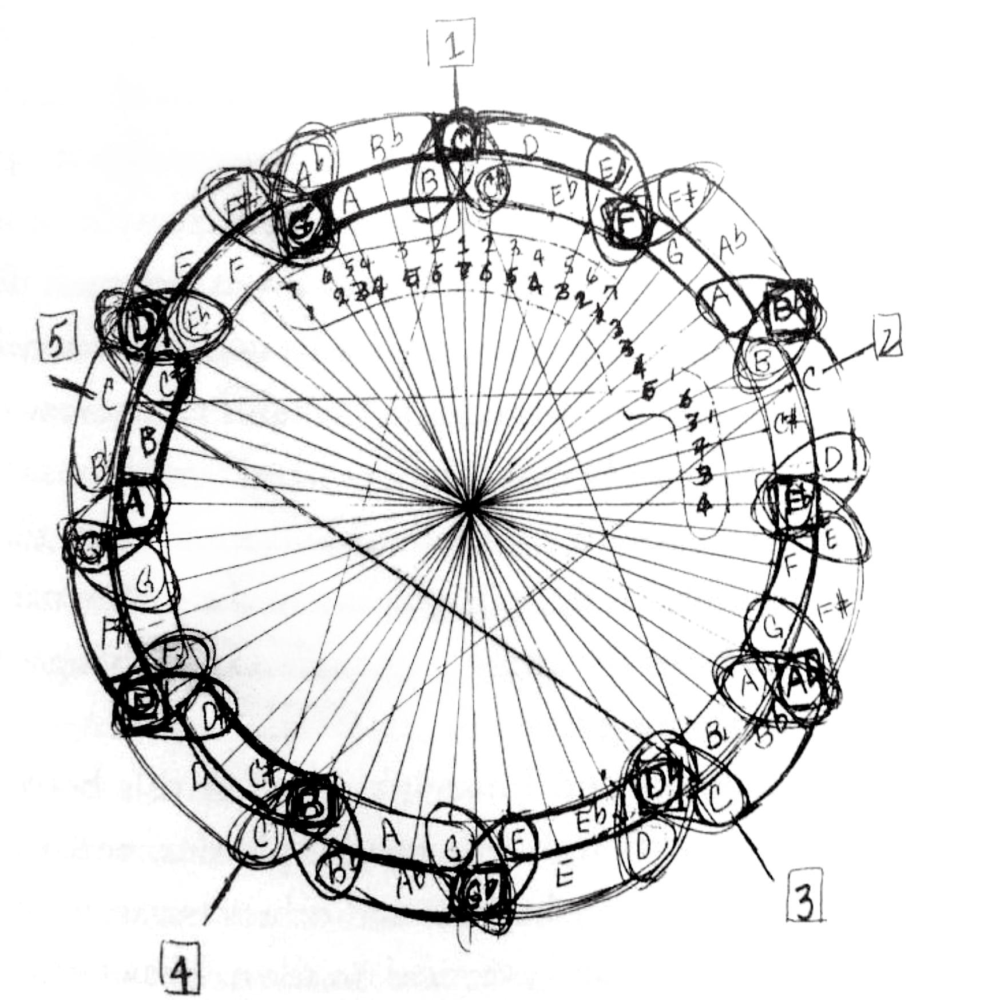

# music

> [\#type:music](https://memex.changbai.li/#type-music), [\#tag:music](https://memex.changbai.li/#tag-music)

## Ear Training

(From Adam Neely & Ben Levin) A couple ear training games to play between two players:

### 1 interval

> Trains: recognizing interval, letter notation

P1 play a note and tells P2 what that note is. P1 then plays a second note, and P2 must identify that note based on hearing the interval between these two notes. Swap and repeat.

### 2 intervals

> Trains: recognizing intervals, letter notation

P1 plays 3 notes. P1 tells P2 what the 1st of these notes was. P2 then have to tell what the other 2 notes are. Finally, P1 changes one of the 3 notes, and P2 has to identify what the changed note was, & what it is now.

### 3 intervals

> Trains: recognizing intervals, recognizing chord qualities (up to 7th chord, and including inversion.), picking notes out of a chord, letter notation

_P2_ plays a chord, and P1 plays a note at the same time. Then, P1 uses that note to identify the chord that P2 played.

### Shortcut to remember intervals

You can remember what intervals sound like by associating them with songs. For example, a _Perfect 4th_ upward can be heard at the beginning of _Bridal Chorus_. These are called __interval songs__.


## Composition

**Motif**: The smallest possible music idea that can still be recognized as a unique idea. By sticking with motifs throughout the piece, the music stays coherent and with identity.

## Theory

#### Circle of Fifth

When it comes to harmonic analysis, circle of fifth is one of the most important concept to remember.


Try to remember the circular sequence both clockwise and counterclockwise.

```text
C G D A E B Gb Db Ab Eb Bb F C
C F Bb Eb Ab Db Gb B E A D G C
```

When looking at the chord changes in a piece of music, think about their positions on the circle of fifth, and observe how the song "moves" around the circle.

In jazz, harmonics are pushed to its limit, and it makes analysis extra fun. Vox has a [wonderful video](https://www.youtube.com/watch?v=62tIvfP9A2w) on John Coltrane's Giant Steps and Circle of Fifth. Speaking of which, here's Coltrane's study of the Circle.



