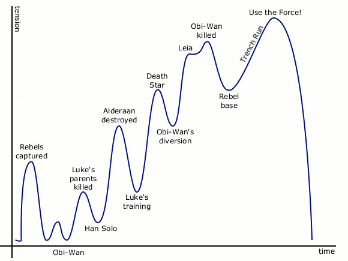

# guitar

> [\#guitar](https://dotcli.github.io/memex/#tag-guitar)

## Warm-up routine

The goal of this routine is to stretch muscles, familiarize with the string, and exercise rhythmic sense.

Do the [usual warm-up exercises](https://www.guitarplayer.com/technique/warm-up-time-11-exercises-that-will-help-you-play-even-better) that walk up and down the fretboard; add variations to it \(e.g. alternate finger pattern, skip strings\).

Play through tuplets of different numbers can give you a really solid sense of time. I use a Guitar Pro tab for this exercise. The tab is a 4-4 beat that starts with all quarter notes, then quintuplets\(5\), sextuplets\(6\), septuplet\(7\), 8th notes, and nonuplets\(9\). Then it goes back down, one by one, all the way to quarter notes, and a bit over: triplets, and half notes.

Download: [.GPX](https://www.dropbox.com/s/t7hi820uphfrke6/Tuplet%20Practice.gpx?dl=0), [.PDF](https://www.dropbox.com/s/5lqz5j929bb8pqq/Tuplet%20Practice.pdf?dl=0)

## Improvising

Some tips on practicing how to solo:

**Follow the interest curve.** The interest curve represents the interest / intensity / engagement of audiences over time, and applies to many types of media. It looks like this:

Notice how the tension builds up over time, and becomes most intense right before the ending \(Obi-Wan killed, trench run, Use the Force\), and simmers down in the ending to provide a sense of resolution \(award ceremony\).

In a 4-bar phrase, do something interesting that adds tension at the 3rd bar; resolve the tension and bring it home at the last bar.

> Another interesting property is that interest curve is fractal; it applies to the flow of tension to a solo, to the structure of the song that solo is in, and to the action of striking the string with your guitar pick, all at the same time.
>
> Related: [Extra Credits video on pacing for game design](https://www.youtube.com/watch?v=5LScL4CWe5E&vl=en); [起承転結](https://en.wikipedia.org/wiki/Kishōtenketsu)

**Add artificial constraints to your solo.** Limitation breeds creativity. Some limiters to experiment with:

* Play a solo with long, sustained notes only. Nothing shorter than a half note.
* Play a solo with short notes only. Nothing longer than an 8th note.
* Play a solo where you are only allowed to play 9 notes each phrase \(every 4 bars\).
* Play a solo where the highest and lowest notes are within 1 octave.

**Play along.** Find a song you like and play along with it. You could try following the melody and solo. Try not to look up tabs when you do this, instead use your ears a lot.

**Keep the chords in mind.** Analyze the relationship between the scales and the underlying chords.

**Stick to the rhythm, no matter what.** If you make a mistake, don't try to fix it, just keep playing.

