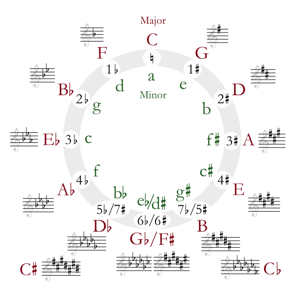
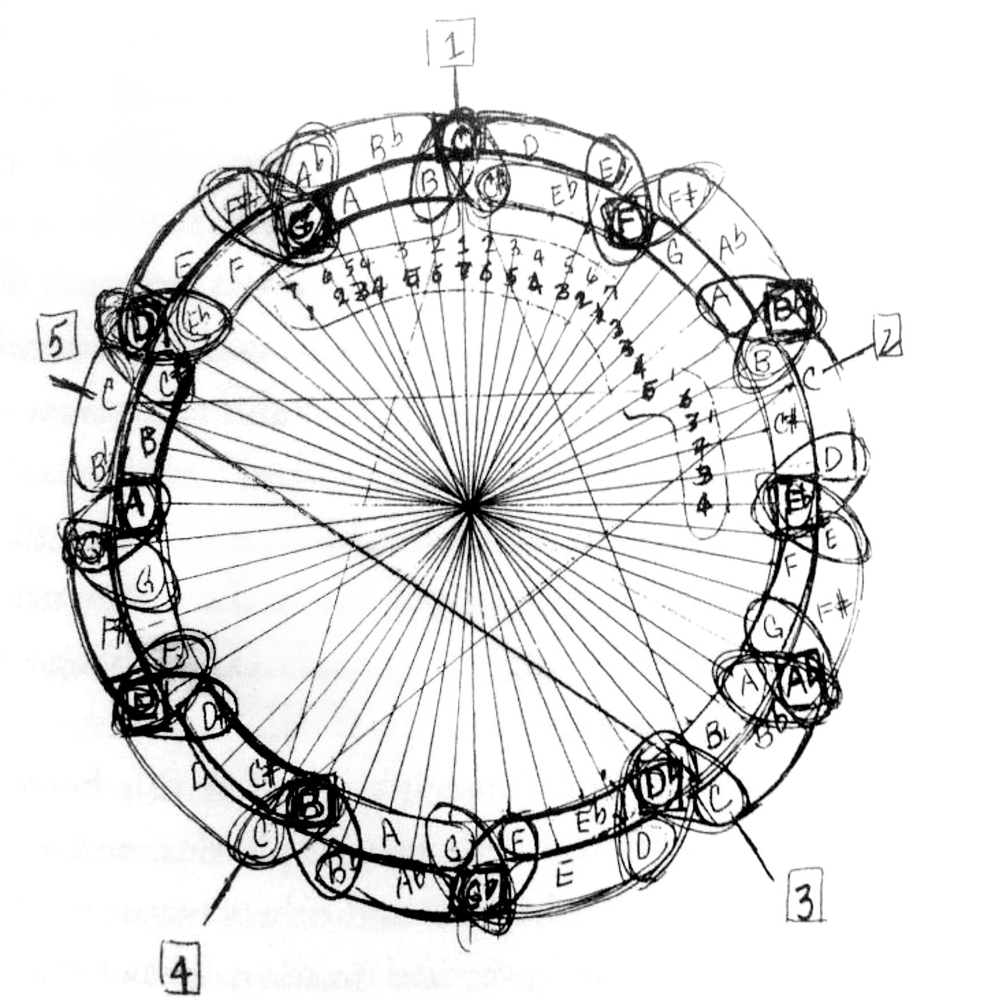

# 音乐

> [\#music](https://dotcli.github.io/memex/#type-music)

### 乐理

#### 五度图

五度图在和声分析中非常好用。



把顺时针和逆时针方向的顺序分别记下来。

```text
C G D A E B Gb Db Ab Eb Bb F C
C F Bb Eb Ab Db Gb B E A D G C
```

分析一首歌的和声走向时可以去注意和弦在五度图上的位置，变换和弦时的移动方式。

用五度图去分析爵士和声是件很好玩的事，有兴趣可以去分析下John Coltrane的Giant Steps。下图是Coltrane自己画的五度图。



